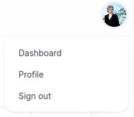
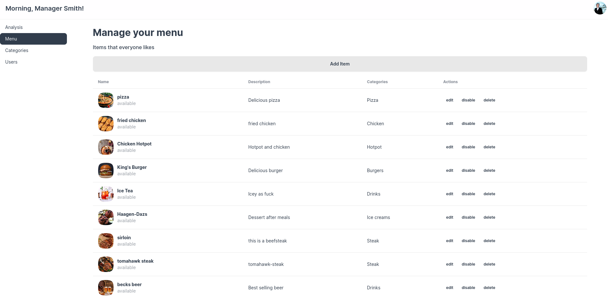
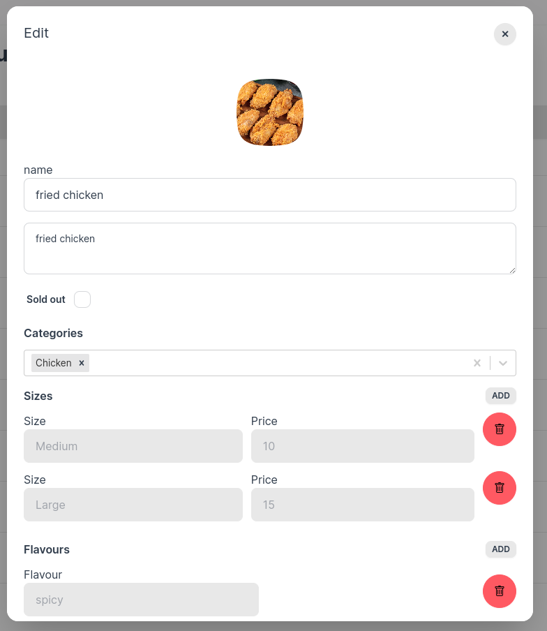

# Restaurant Ordering System Frontend

💡 **Overview**

**front-end repo**
[https://github.com/JensLiu/restaurant-ordering-system-frontend](https://github.com/JensLiu/restaurant-ordering-system-frontend)

**back-end repo**
[https://github.com/JensLiu/restaurant-ordering-system-backend](https://github.com/JensLiu/restaurant-ordering-system-backend)

**Project demo**
[https://ordering.jensdevelops.de](https://ordering.jensdevelops.de)

⚠️ Do **NOT** enter your payment information, instead use the test card provided in the documentation </br>
TL; DR: Card No. 4242 4242 4242 4242 [Document: Test payment methods](https://stripe.com/docs/testing)

👤 Accounts
- `customer@jensdevelops.de`
- `chef@jensdevelops.de`
- `manager@jensdevelops.de`

Password: `password`

## Use case


## Deployment: Railway Architecture


# Frontend Tech Stack

| Tech                      | Used in                  |
|---------------------------|--------------------------|
| Next.js                   | project framework        |
| Zustand                   | global status management |
| React Hook Form           | dynamic form             |
| React Hot Toast           | toast                    |
| Cookie-next               | cookie access            |
| Next-Cloudinary           | cloudinary image upload  |
| Tailwind CSS              | CSS framework            |
| Clsx                      | dynamic CSS              |
| Daisy UI + React Daisy UI | CSS UI library           |
| React Icon                | icon library             |

# Business Process Demo

- Customer & Chef
  [demo video](https://youtu.be/-K2kpVm_Vvw)

- Customer: Continue unfinished Payment
  [demo video](https://youtu.be/D_qsMaLWkkg)

- Manager: Add menu item
  [demo video](https://youtu.be/Pf5HHALj_vA)

- Manager: Menu Management (and constraints)
  [demo video](https://youtu.be/DA6mWr74zDI)

# Actors

## Customer
### Register and Login
- Customers can `login` by clicking the top-right avatar and select `login` </br>


- A `login`/`register` modal will pop up, fill the corresponding information </br>


- After `login`, customers are able to access their `Orders` page and `Profile` page 
by clicking the top-right avatar </br>


### Profile Management
*Changing of password is not implemented in the demo*


### Menu Overview


### Item Selection


### Cart
- On `Checkout`, the customer is redirected to the stripe payment page.
- After the customer finished the payment, he/she is redirected to the `Orders` page


### Orders
- Notifications are pushed when the chef `Accept`s or `Complete`s the order
- The page is refreshed at the same time to reflect the change of `status`


## Manager
After login, managers can negate through their features by clicking the top-right avatar </br>

### Dashboard


### Menu Management
- Menu Dashboard

- Menu Item Edit 


### Category Management


### User Management
*User editing and deletion are not implemented in the demo.* </br>
*The manager can only delete/fire chefs, they cannot delete any customers or their fellow managers.*


## Chef
After login, chefs can navigate through their features by clicking the top-right avatar </br>

### Workspace
- The workspace automatically refreshes when a new order is paid
- Chef workflow: Select a waiting order -> `Accept` the order -> `Complete` the order
- When chef `Accept`s or `Completes`s an order, the customer will receive a notification


# Deployment

create a `.env` file in the root directory

```dotenv
JWT_SECRET_KEY="your-secrete-key"
NEXT_CLOUDINARY_UPLOAD_PRESET="your-cloudinary-upload-preset"
STRIPE_SECRET_KEY="your-stripe-secret-key"
ACCESS_TOKEN_COOKIE_NAME=_app_access_token
REFRESH_TOKEN_COOKIE_NAME=_app_refresh_token

# MEXT_PUBLIC prefix exposes the variable to the client side
NEXT_PUBLIC_CLOUDINARY_CLOUD_NAME="your-cloudinary-cloud-name"
NEXT_PUBLIC_API_BASE_URL="https://ordering-api.jensdevelops.de"     # example
NEXT_PUBLIC_WEBSITE_BASE_URL="https://ordering.jensdevelops.de"     # example
NEXT_PUBLIC_WS_API_BASE_URL="wss://ordering-api.jensdevelops.de"    # example
```